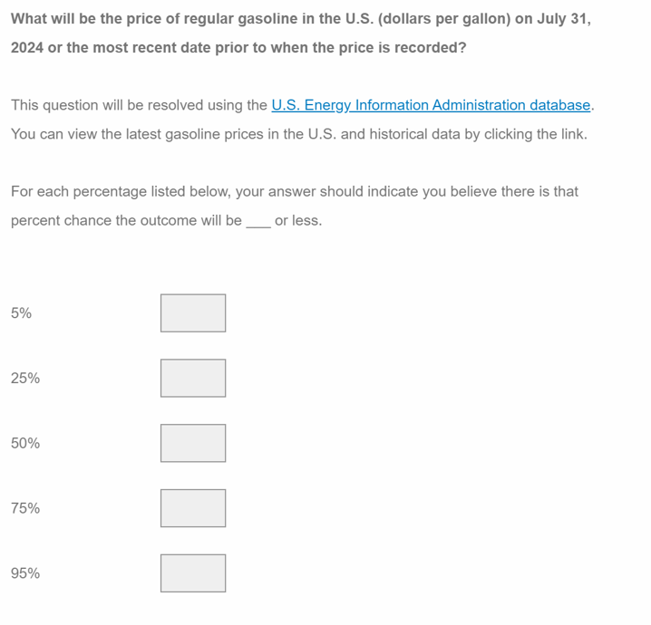
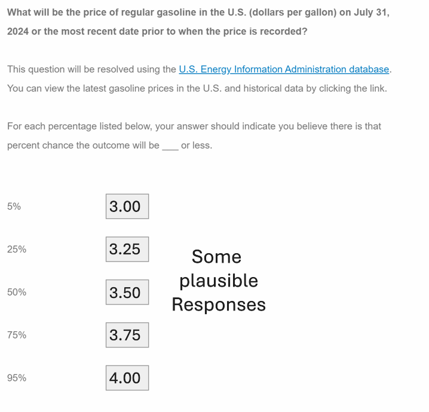
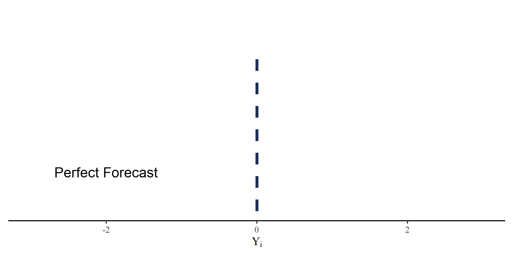
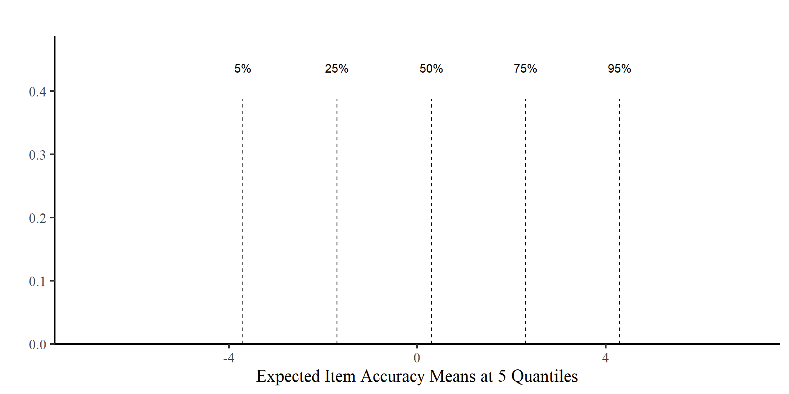
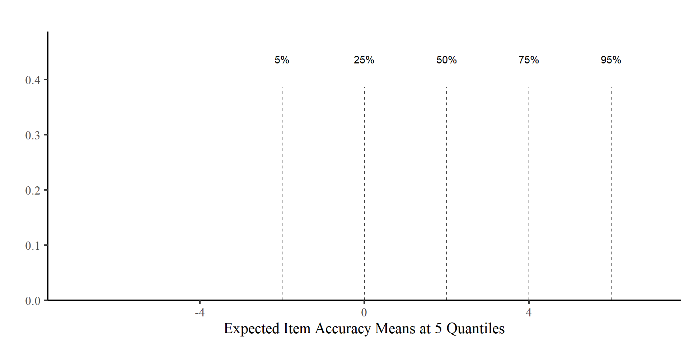
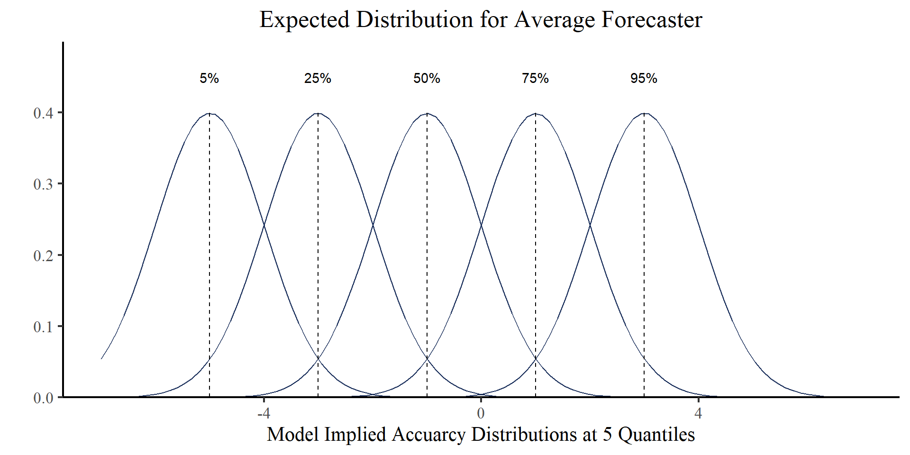
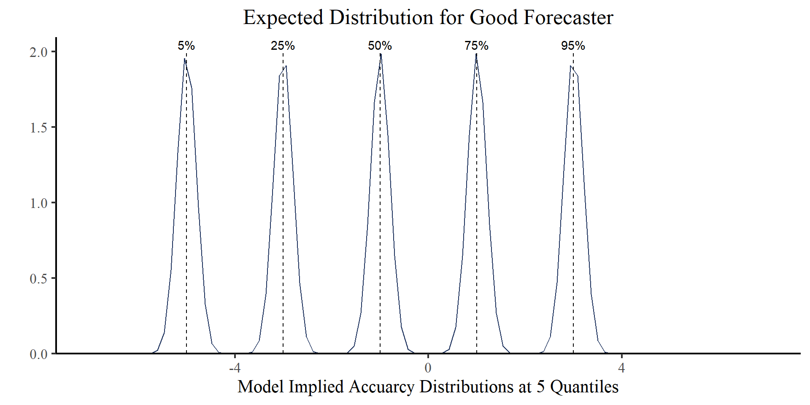
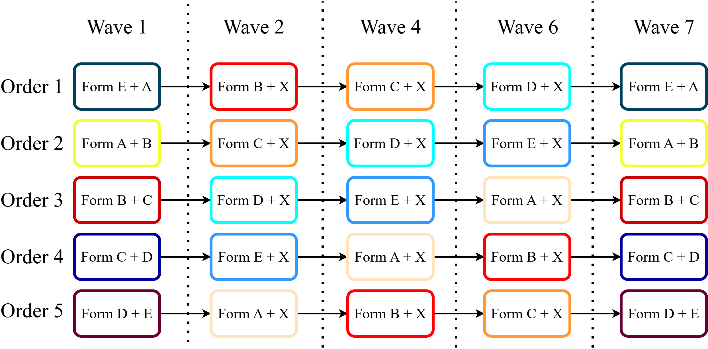
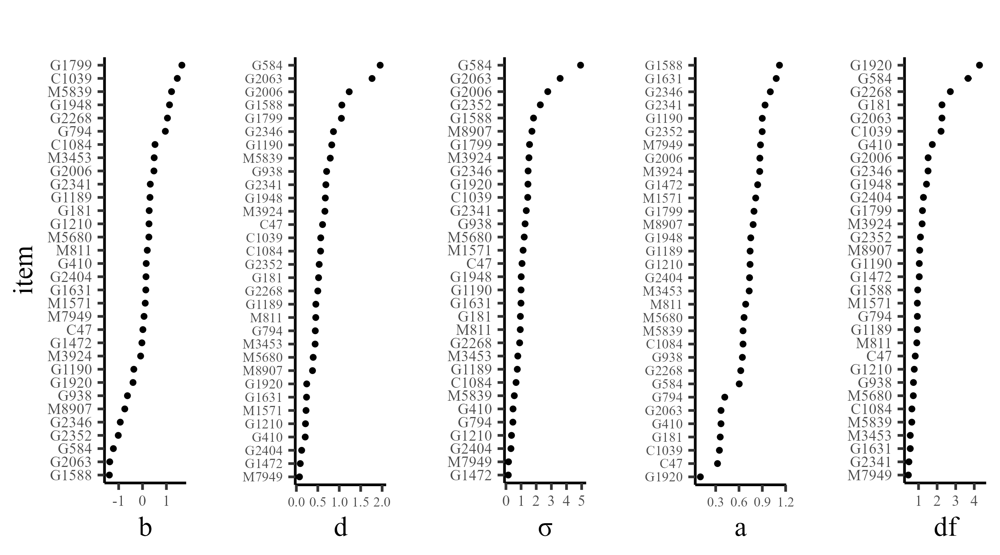
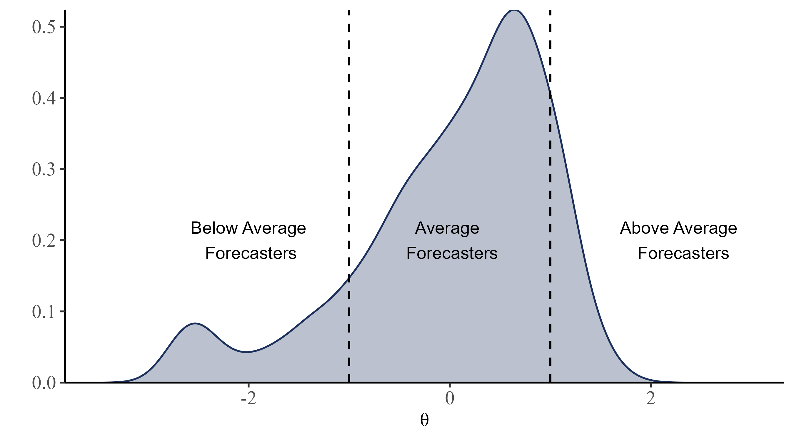

## Quantile Forecasts


::: {.cell}

:::


The Forecasting Proficiency Test [FPT\; @Himmelstein_etal_2024] is a test developed to measure forecasting proficiency. The FTP uses *quantile forecast* items:


:::: {.columns}

::: {.column width="40%"}

::: {.fragment fragment-index=1}

<center> **FPT sample item:** </center>
:::

::: {.r-stack}

{.fragment fragment-index=1}

{.fragment fragment-index=2}
:::

:::

::: {.column width="60%"}


::: {.fragment fragment-index=2}

Quantile forecasting items are designed to elicit an individual's subjective cumulative distribution function (CDF) regarding a future continuous outcome

:::


::: {.fragment fragment-index=3}

- Each individual provides 5 monotonically increasing responses

- Responses are unbounded

- *Forecast accuracy* is the measure of interest 
:::

::: {.fragment fragment-index=4}
**GOAL:** in IRT fashion, modeling forecast accuracy by positing a statistical model that accounts for both *person* and *item* features
:::

:::

::::


## Defining Forecast Accuracy


Responses to FTP quantile forecast items are on very different scale (e.g. dollars/gallon, thousands of dollars, percentages,...). We define the outcome measure, *historically scaled accuracy*, as


$$
Y_i = \frac{\hat{Y}_i - Y_{\mathrm{res},i}}{SD_{Y_{\mathrm{hist},i}}}
$$

:::: {.columns}
::: {.column width="55%"}


<ul style="font-size: 26px">  

<li>  $\hat{Y}_i$: Reported forecast for item $i$ at any quantile.   </li>

<li>  $Y_{\mathrm{res},i}$: The resolution for item $i$.   </li>

<li>  $SD_{Y_{\mathrm{hist},i}}$: The $SD$ of the historical time series of item $i$.    </li>

</ul>


:::
::: {.column width="45%"}

::: {.fragment fragment-index=1}

$Y_i$: SD units away from the resolution.

:::

::: {.r-stack}

::: {.fragment fragment-index=1}


::: {.cell}
::: {.cell-output-display}
{width=960}
:::
:::

:::

::: {.fragment fragment-index=2}


::: {.cell}
::: {.cell-output-display}
{width=960}
:::
:::


:::

::: {.fragment fragment-index=3}


::: {.cell}
::: {.cell-output-display}
{width=960}
:::
:::


:::

:::


:::
::::

## Assumptions About Item Behavior


::: {.cell}

:::


:::: {.columns}
::: {.column width="50%"}


**Assumption 1:** Items are always biased to some extent (*irreducible uncertainty*) 

::: {.panel-tabset}

### Slightly Biased Item


::: {.cell}
::: {.cell-output-display}
{width=960}
:::
:::


### Noticeably Biased Item 


::: {.cell}
::: {.cell-output-display}
{width=960}
:::
:::


 
:::
 
:::

::: {.column width="50%"}

::: {.fragment fragment-index=1}

**Assumption 2:** Good forecasters will more closely approach the expected means at the 5 quantiles 


::: {.panel-tabset}

### Average Forecaster


::: {.cell}
::: {.cell-output-display}
{width=960}
:::
:::


### Good Forecaster


::: {.cell}
::: {.cell-output-display}
{width=960}
:::
:::

:::

:::

:::

::::


## The Proposed Model


We model $Y_{jiq}$, the accuracy of person $j$ to item $i$ at quantile $q$. 


:::: {.columns}
::: {.column width="40%"}

$$Y_{jiq} \sim \mathrm{Student\ T}(\mu_{iq}, \sigma_{ji}, \mathrm{df}_i) \\
\mu_{iq} = b_i + Q_q \times d_i \\
\sigma_{ji} = \frac{\sigma_i}{\mathrm{Exp}[a_i \times \theta_j]}$$


<ul style="font-size: 22px">  

::: {.fragment fragment-index=1}
<li>  $b_i$: item bias  </li>
:::

::: {.fragment fragment-index=2}
<li>  $d_i$: expected quantile distance. $Q_q$ is a vector of constants that ensures monotonicity of $\mu_{iq}$  </li>
:::

::: {.fragment fragment-index=3}
<li>  $\sigma_i$: item difficulty </li>
:::

::: {.fragment fragment-index=4}
<li>  $\theta_j$: Forecasting ability, the only **person parameter** in the model </li>
:::

::: {.fragment fragment-index=5}
<li>  $a_i$: item discrimination (i.e. the effect of $\theta_j$ on $\sigma_i$)  </li>
:::

</ul>


:::
::: {.column width="60%"}

<iframe class="stretch" width="100%" height="550px" src="https://quinix45.github.io/shinylive_apps/t_model/"> </iframe>

:::
::::


## Data Collection

Item forecasts were collected across 5 waves of a 7 Wave study. 


:::: {.columns}
::: {.column width="30%"}

</br>

<ul style="font-size: 26px">  

<li>  **32 items** divided across 6 forms (A, B, C, D, E, X)  and **1194 participants** </li>


::: {.fragment fragment-index=1}

<li> Diverse item domains: Financial, political, technology, energy... </li>

:::

::: {.fragment fragment-index=2}

<li> 1 week interval between waves, and 1 month from resolution at wave 7  </li>

:::
</ul>


</br>


:::
::: {.column width="70%"}





<div style="font-size: 16px"> *note*. The full experimental designed is detailed in both @Zhu_etal_2024 and @Himmelstein_etal_2024.</div>

:::
::::


## Model Estimation and Item Parameters

All models were estimated in PyMC [@pymc2023] using Markov Chain Monte Carlo (MCMC) estimation (warmup = 1000, draws = 5000, ~ 40 minutes). All Rhats $\leq 1.01$. 

<center>

::: {.fragment fragment-index=1}

{width=70%}

:::

</center>

## Person Parameter: $\theta$


Distribution of $\theta$ for the 1194 forecasters (better forecasters have higher $\theta$ values).

<center>
{width=70%}
</center>
<div style="font-size: 16px; margin-top: -16px; text-align:center;"> *note*. The scale $\theta$ parameter was identified by enforcing a standard normal prior.</div>


## Who gets Higher $\theta$s?

Forecasters who consistently approach the expected forecasts are rewarded


:::: {.columns}
::: {.column width="80%"}
<center>
{width=75%}
</center>
:::
::: {.column width="20%"}

</br>

<div style="font-size: 22px"> *note*. In the case of the two top panels, missing person forecast were outside the $Y_{jiq} = [-9; 9]$ range.</div>

:::
::::


## Predicting Out of Sample Accuracy


<div style="font-size: 24px"> As per the study design, Waves 1 and 7 responses were treated as *outcome* and Waves 2,4, 6 were treated as *predictors*. </div>


::: {.fragment fragment-index=1}

:::: {.columns}
::: {.column width="30%"}


</br>
</br>

<div style="font-size: 26px; padding-top: 14px;"> **S-scores (SS):** A proper scoring rule that is normally used to score quantile forecasts (smaller SS, better forecast) </div>


:::
::: {.column width="70%"}

{width=95%}

:::
::::

:::


## Expected Item Information

One advantage of the $\theta$ metric is that it allows for the calculation of *expected item information*, $\mathrm{EI}(\theta)$ :


:::: {.columns}
::: {.column width="40%"}

$$Y_{jiq} \sim \mathrm{Student\ T}(\mu_{iq}, \sigma_{ji}, \mathrm{df}_i) \\
\mu_{iq} = b_i + Q_q \times d_i \\
\sigma_{ji} = \frac{\sigma_i}{\mathrm{Exp}[a_i \times \theta_j]}$$


<ul style="font-size: 22px">


::: {.fragment fragment-index=1}

<li> Items with higher $\sigma_i$ measure more skilled forecasters better (*difficulty*) </li>
:::

::: {.fragment fragment-index=2}
<li> Higher $a_i$ implies better measurement within a narrower interval of $\theta$ (*discrimination*) </li>
:::

::: {.fragment fragment-index=3}
<li>  $df_i$ functions in a similar way to $\sigma_i$.  </li>
:::

::: {.fragment fragment-index=4}
<li>  The parameters within $\mu_{iq}$ do not influence $\mathrm{E} \mathrm{I}(\theta)$ much. </li>
:::

</ul>

:::

::: {.column width="60%"}

<iframe class="stretch" width="100%" height="450px" src="https://quinix45.github.io/shinylive_apps/Einfo_t_model/"> </iframe>
<div style="font-size: 18px; text-align:center;"> **note:** $\mathrm{E} \mathrm{I}(\theta)$ is computed by integrating over $Y_{jiq}[-10;10]$. </div>

:::
::::

## Stability of Parameters

Given the complexity of the FPT items, item parameters are likely to change depending on many factors. Still, there seems to be reasonable stability even after a month between Wave 1 and Wave 7 (*test-retest*):


::: {.fragment fragment-index=1}
<center>
{width=58%}
<div style="font-size: 14px"> *note*. Only items from Waves 1 and 7. The $a_i$ parameter requires higher sample sizes to stably estimate, so it was fixed to 1. </div>
</center>
:::


## Takeaways

:::: {.columns}
::: {.column width="30%"}

::: {.fragment fragment-index=1}
- The current approach captures meaingful difference across FPT items (i.e., bias, difficulty, discrimination,...)
:::

::: {.fragment fragment-index=2}
- The $\theta$ metric is easily undesrtood and viable for scoring individuals 
:::

::: {.fragment fragment-index=3}
- Item information can be calculated, although the practical uses are not as straightforward as conventional testing scenarios 
:::
:::

:::{.column width="70%"}
:::{.r-stack}

::: {.fragment fragment-index=1 .fade-in-then-out}

:::

::: {.fragment fragment-index=2 .fade-in-then-out}
<center>
{width=50%}
{width=55%}
</center>
:::

::: {.fragment fragment-index=3}
<iframe class="stretch" width="900px" height="600px" src="https://quinix45.github.io/shinylive_apps/Einfo_t_model/"></iframe>
:::

:::
:::

::::


## Acknowledgments


## References 

<div id="refs"> </div>


# Appendix


## Negative Log-Likelihood of $\theta$


Negative log-likelihood function of $\theta$ given item parameters and participant response:

<iframe class="stretch" width="100%" height="500px" src="https://quinix45.github.io/shinylive_apps/MLE_theta_model_t/"> </iframe>


## Between Item Parameters Correlation


::: {.cell}
::: {.cell-output-display}
`````{=html}
<table class=" lightable-classic table" style="font-family: Palatino Linotype; width: auto !important; margin-left: auto; margin-right: auto; font-size: 30px; margin-left: auto; margin-right: auto;">
<caption style="font-size: initial !important;">Between Item Parameters Correlations</caption>
 <thead>
  <tr>
   <th style="text-align:left;font-weight: bold;">   </th>
   <th style="text-align:right;font-weight: bold;"> a </th>
   <th style="text-align:right;font-weight: bold;"> b </th>
   <th style="text-align:right;font-weight: bold;"> d </th>
   <th style="text-align:right;font-weight: bold;"> df </th>
   <th style="text-align:right;font-weight: bold;"> sigma </th>
  </tr>
 </thead>
<tbody>
  <tr>
   <td style="text-align:left;font-weight: bold;"> a </td>
   <td style="text-align:right;"> 1.00 </td>
   <td style="text-align:right;"> -0.17 </td>
   <td style="text-align:right;"> 0.00 </td>
   <td style="text-align:right;"> -0.57 </td>
   <td style="text-align:right;"> -0.04 </td>
  </tr>
  <tr>
   <td style="text-align:left;font-weight: bold;"> b </td>
   <td style="text-align:right;"> -0.17 </td>
   <td style="text-align:right;"> 1.00 </td>
   <td style="text-align:right;"> -0.33 </td>
   <td style="text-align:right;"> -0.18 </td>
   <td style="text-align:right;"> -0.51 </td>
  </tr>
  <tr>
   <td style="text-align:left;font-weight: bold;"> d </td>
   <td style="text-align:right;"> 0.00 </td>
   <td style="text-align:right;"> -0.33 </td>
   <td style="text-align:right;"> 1.00 </td>
   <td style="text-align:right;"> 0.35 </td>
   <td style="text-align:right;"> 0.86 </td>
  </tr>
  <tr>
   <td style="text-align:left;font-weight: bold;"> df </td>
   <td style="text-align:right;"> -0.57 </td>
   <td style="text-align:right;"> -0.18 </td>
   <td style="text-align:right;"> 0.35 </td>
   <td style="text-align:right;"> 1.00 </td>
   <td style="text-align:right;"> 0.52 </td>
  </tr>
  <tr>
   <td style="text-align:left;font-weight: bold;"> sigma </td>
   <td style="text-align:right;"> -0.04 </td>
   <td style="text-align:right;"> -0.51 </td>
   <td style="text-align:right;"> 0.86 </td>
   <td style="text-align:right;"> 0.52 </td>
   <td style="text-align:right;"> 1.00 </td>
  </tr>
</tbody>
</table>

`````
:::
:::


