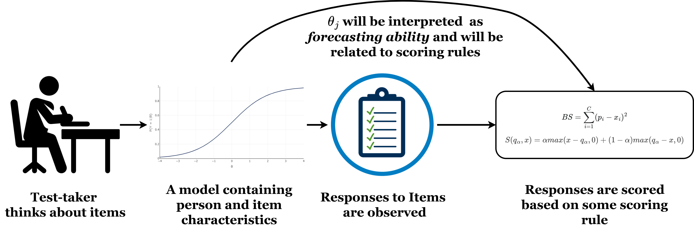
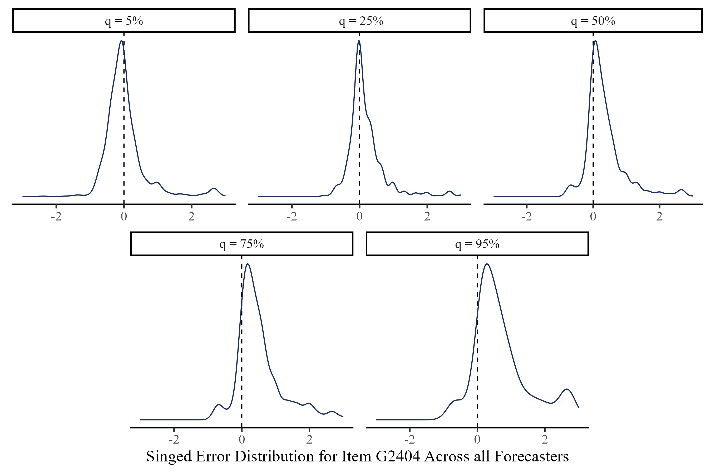
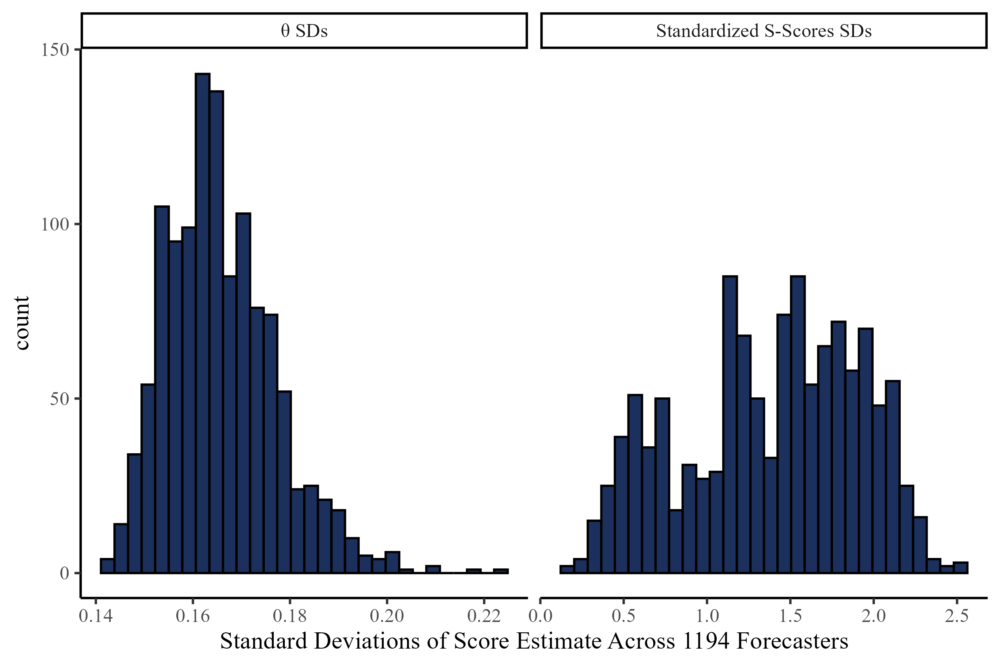
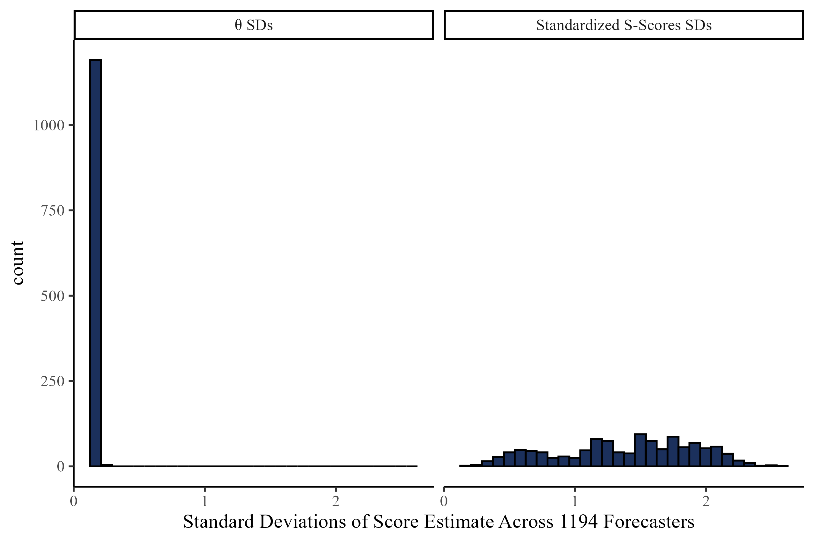

```{r}
#| warning: false

# ggplot defaults and tidyverse

library(tidyverse)
theme_set(theme_classic(base_size = 16, 
                        base_family = 'serif'))

mod_res <- rio::import("Additional files/summary.csv")
```


##


<div style="position: absolute; top:25%; left:0%; width:"1300px">
  
</div>

## 


<div style="position: absolute; top:25%; left:0%; width:"1400px">
  
</div>

## 

<div style="position: absolute; top:15%; left:0%; width:"1400px">
  
</div>


## Psychometrics

:::: {.columns}
::: {.column width="60%"}


</br>
<center> <div style="font-size: 32px"> The interest of *psychometrics* is uncovering the probabilistic process that <u>**causes**</u> item responses. </div> </center>

</br>

::: {.fragment fragment-index=1}


in general, psychometric models are statistical models that predict item responses. All psychometric models include:

- Parameters defining **item properties**
- Parameters defining **person properties**
- Allow for some **randomness** in item responses (random measurement error)
:::

::: {.fragment fragment-index=2}
<center>

<div style="padding-top:24px;"> **Item response theory** (IRT) models include all of these components. </div>


</center>
:::

:::
::: {.column width="40%"}

<center>

{width="60%"}
</center>

:::
::::

## A Classical IRT Model


According to this IRT model, the *probability* of a correct response to a binary item $i$ for person $j$ ($Y_{ij} = 1$) is: 

:::: {.columns}
::: {.column width="60%"}

<iframe class="stretch" width="100%" height="470px" src="https://quinix45.github.io/shinylive_apps/2PL_interactive/"> </iframe>

:::

::: {.column width="40%"}

$$P(Y_{ij} = 1|a_i,b_i,\theta_j) = \mathrm{logit}(a_i(\theta_j - b_i))$$

:::{.fragment fragment-index=1}
- $\theta_j$ is an unobserved person trait that explains why responses from the same individuals are similar to each other (i.e., **ability**)
:::

:::{.fragment fragment-index=2}

- $a_i$ and $b_i$ are characteristics that vary across items (e.g., items can be more or less difficult)

:::

:::
::::

## Why Psychometrics and IRT?


With psychometric models, not only do we explain the observed responses, but we also obtain **item characteristics** and **person characteristics**. 

::: {.fragment fragment-index=1}

**Question:** Can we do the same for quantile forecast items in the Forecasting Proficiency Test [FPT\; @Himmelstein_etal_2024]?

  
:::

## Historical Standardization 

Responses to FPT quantile forecast items are on very different scales (e.g. dollars/gallon, thousands of dollars, percentages,...). We define the outcome measure, *historically scaled signed error*, as


$$
Y_i = \frac{\hat{Y}_i - Y_{\mathrm{res},i}}{SD_{Y_{\mathrm{hist},i}}}
$$

:::: {.columns}
::: {.column width="55%"}


<ul style="font-size: 26px">  

<li>  $\hat{Y}_i$: Reported forecast for item $i$ at any quantile.   </li>

<li>  $Y_{\mathrm{res},i}$: The resolution for item $i$.   </li>

<li>  $SD_{Y_{\mathrm{hist},i}}$: The $SD$ of the historical time series of item $i$.    </li>

</ul>


:::
::: {.column width="45%"}

::: {.fragment fragment-index=1}

$Y_i$: SD units away from the resolution.

:::

::: {.r-stack}

::: {.fragment fragment-index=1}

```{r}
ggplot() +
  xlim(c(-3, 3)) +
  ylim(c(0, 5)) +
  xlab(expression(Y[i])) +
   geom_segment(aes(x = 0, xend = 0, y = 0, yend = 4), linetype = 2, 
                col = "#1b305c",
                size = 2)+
  annotate("text", x = -2, y = 1, label = "Perfect Forecast",
           size = 7) +
  theme(axis.ticks.y = element_blank(),
        axis.title.y =element_blank(),
        axis.line.y = element_blank(),
        axis.text.y =  element_blank())

```
:::

::: {.fragment fragment-index=2}

```{r}
ggplot() +
  xlim(c(-3, 3)) +
  ylim(c(0, 5)) +
  xlab(expression(Y[i])) +
   geom_segment(aes(x = 2, xend = 2, y = 0, yend = 4), linetype = 2,
                col = "#1b305c",
                size = 2)+
  annotate("text", x = 0, y = 1, label = "2 SD Above \n Resolution",
           size = 7) +
  theme(axis.ticks.y = element_blank(),
        axis.title.y =element_blank(),
        axis.line.y = element_blank(),
        axis.text.y =  element_blank())


```

:::

::: {.fragment fragment-index=3}

```{r}
ggplot() +
  xlim(c(-3, 3)) +
  ylim(c(0, 5)) +
  xlab(expression(Y[i])) +
   geom_segment(aes(x = -1, xend = -1, y = 0, yend = 4), linetype = 2,
                col = "#1b305c",
                size = 2)+
  annotate("text", x = 0, y = 1, label = "1 SD Below \n Resolution",
           size = 7) +
  theme(axis.ticks.y = element_blank(),
        axis.title.y =element_blank(),
        axis.line.y = element_blank(),
        axis.text.y =  element_blank())


```

:::

:::


:::
::::

## Observed Distributions of Signed Error

:::: {.columns}
::: {.column width="70%"}

 

:::
::: {.column width="30%"}

<center>

{width=70%} 


**Item G2404:** What will be the 12-month percentage change in the U.S. Consumer Price Index (CPI) for "Food" in the month between May 1, 2024 and May 31, 2024?

</center>

:::
::::


## Modeling Signed Error


We model $Y_{jiq}$, the signed error of person $j$ to item $i$ at quantile $q$. 


:::: {.columns}
::: {.column width="40%"}

$$Y_{jiq} \sim \mathrm{Student\ T}(\mu_{iq}, \sigma_{ji}, \mathrm{df}_i) \\
\mu_{iq} = b_i + Q_q \times d_i \\
\sigma_{ji} = \frac{\sigma_i}{\mathrm{Exp}[a_i \times \theta_j]}$$


<ul style="font-size: 22px">  

::: {.fragment fragment-index=1}
<li>  $b_i$: item bias (*irreducible uncertainty*) </li>
:::

::: {.fragment fragment-index=2}
<li>  $d_i$: expected quantile distance. $Q_q$ is a vector of constants that ensures monotonicity of $\mu_{iq}$  </li>
:::

::: {.fragment fragment-index=3}
<li>  $\sigma_i$: item difficulty </li>
:::

::: {.fragment fragment-index=4}
<li>  $\theta_j$: Forecasting ability, the only **person parameter** in the model </li>
:::

::: {.fragment fragment-index=5}
<li>  $a_i$: item discrimination (i.e. the magnitude of the effect of $\theta_j$ on $\sigma_i$)  </li>
:::

</ul>


:::
::: {.column width="60%"}

<iframe class="stretch" width="100%" height="550px" src="https://quinix45.github.io/shinylive_apps/t_model/"> </iframe>

:::
::::


## Model Estimation and Item Parameters

All models were estimated in PyMC [@pymc2023] using Markov Chain Monte Carlo (MCMC) estimation (warmup = 1000, draws = 5000, ~ 40 minutes). All Rhats $\leq 1.01$. 

<center>

::: {.fragment fragment-index=1}

{width=70%}

:::

</center>

## Person Parameter: $\theta$


Distribution of $\theta$ for the 1194 forecasters (better forecasters have higher $\theta$ values).

<center>
{width=70%}
</center>
<div style="font-size: 16px; margin-top: -16px; text-align:center;"> *note*. The scale $\theta$ parameter was identified by enforcing a standard normal prior.</div>


## Who gets Higher $\theta s$?


:::: {.columns}
::: {.column width="80%"}
<center>
{width=75%}
<div style="font-size: 22px"> *note*. In the case of the two top panels, missing person forecast were outside the $Y_{jiq} = [-9; 9]$ range.</div>
</center>
:::
::: {.column width="20%"}

For any set of quantile forecasts, $\theta$ is maximized *if and only if* all *person forecasts* ($Y_{jiq}$) equal exactly the corresponding item expected forecasts ($\mu_{iq}$).


:::
::::

## Negative Log-Likelihood of $\theta$


Negative log-likelihood function of $\theta$ given item parameters and forecast:

<iframe class="stretch" width="100%" height="500px" src="https://quinix45.github.io/shinylive_apps/MLE_theta_model_t/"> </iframe>


## Uncertainty Around $\theta$ and S-Scores


$\theta$ has less uncertainty around its estimates:

:::: {.columns}
::: {.column width="50%"}


{width=110%}


<center> <div style="font-size: 22px"> Different X-axis scale across panels </div> </center>

:::
::: {.column width="50%"}

::: {.fragment fragment-index=1}


{width=110%}

<center> <div style="font-size: 22px"> Same X-axis scale  across panels </div> </center>
:::
:::
::::


## Predicting Out of Sample Accuracy


:::: {.columns}
::: {.column width="30%"}

<div style="font-size: 26px"> As per the study pre-registration, Waves 1 and 7 responses were treated as *outcome* and Waves 2,4, 6 were treated as *predictors*. </div>

</br>
</br>

<div style="font-size: 24px; padding-top: 14px;"> \* **SS** stands for **S-Score**  </div>


:::
::: {.column width="70%"}

{width=95%}

:::
::::


## Takeaways

:::: {.columns}
::: {.column width="30%"}

::: {.fragment fragment-index=1}
- This approach captures meaningful difference across FPT items (i.e., bias, difficulty, discrimination,...)
:::

::: {.fragment fragment-index=2}
- The $\theta$ metric is easily understood and presents good statistical properties
:::


::: {.fragment fragment-index=3}
- The $\theta$ metric predicts out of sample accuracy well
:::

:::

:::{.column width="70%"}
:::{.r-stack}

::: {.fragment fragment-index=1 .fade-in-then-out}

:::

::: {.fragment fragment-index=2 .fade-in-then-out}
<center>

{width=50%}
{width=55%}
</center>

:::

::: {.fragment fragment-index=3 .fade-in-then-out}
<center>


</center>
:::
:::
:::
::::


## $\theta$ And S-scores?

:::: {.columns}
::: {.column width="50%"}


::: {.fragment fragment-index=1}

<center>
<figure>
  
  <figcaption style="font-size: 30px"> Magnus Carlsen, the best chess player in the world (highest $\theta$) </figcaption>
</figure>
</center>

:::

:::
::: {.column width="50%"}

::: {.fragment fragment-index=2}
<center>
<figure>
  <div class="tenor-gif-embed" 
       data-postid="16228483763522153196" 
       data-share-method="host" 
       data-aspect-ratio="1.1267" 
       data-width="80%">
    <a href="https://tenor.com/view/magnus-carlsen-magnus-slam-table-slam-angry-gif-16228483763522153196">
      Magnus Carlsen Slam GIF
    </a> 
    from 
    <a href="https://tenor.com/search/magnus+carlsen-gifs">Magnus Carlsen GIFs</a>
  </div>
  <script type="text/javascript" async src="https://tenor.com/embed.js"></script>
  <figcaption style="font-size: 30px">Magnus still loses every once in a while (i.e., lower S-score in some instances) </figcaption>
</figure>
</center>
:::
:::
::::


## Acknowledgments{visibility="hidden"}

:::: {.columns}
::: {.column width="30%"}


{width=50%}
 
<figure>
  
  <figcaption style="text-align:left;">Leah Feuerstahler</figcaption>
</figure>


:::
::: {.column width="70%"}


<center> 
{width=50%}

<div style="display:flex; font-size:26px;">
<figure>
  
  <figcaption>Mark Himmelstein</figcaption>
</figure>
<figure>
  
  <figcaption>Sophie Ma Zhu</figcaption>
</figure>
<figure>
  
  <figcaption>Nikolay Petrov</figcaption>
</figure>
<figure>
  
  <figcaption>Ezra Karger</figcaption>
</figure>
</div>
</center>

:::
::::


## References And Contacts

<div id="refs"> </div>


:::: {.columns}
::: {.column width="50%"}


<center>
<div style="font-size: 30px"> Contact: [fsetti@fordham.edu](mailto:fsetti@fordham.edu){target="_blank"}
 </div>
<figure>
  
</figure>
</center>

:::
::: {.column width="50%"}

<center>
<div style="font-size: 30px"> **Slides and More** </div>

<figure>
  

</figure>
</center>


:::
::::
[](){target="_blank"}

# Appendix

## Stability of Parameters

Given the complexity of the FPT items, item parameters are likely to change depending on many factors. Still, there seems to be reasonable stability even after a month between Wave 1 and Wave 7 (*test-retest*):


::: {.fragment fragment-index=1}
<center>
{width=58%}
<div style="font-size: 14px"> *note*. Only items from Waves 1 and 7. The $a_i$ parameter requires higher sample sizes to stably estimate, so it was fixed to 1. </div>
</center>
:::


