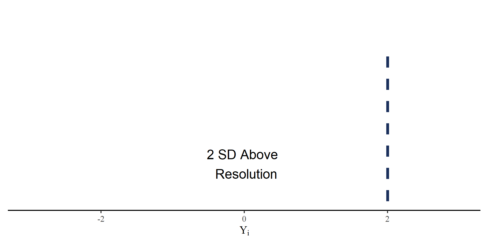
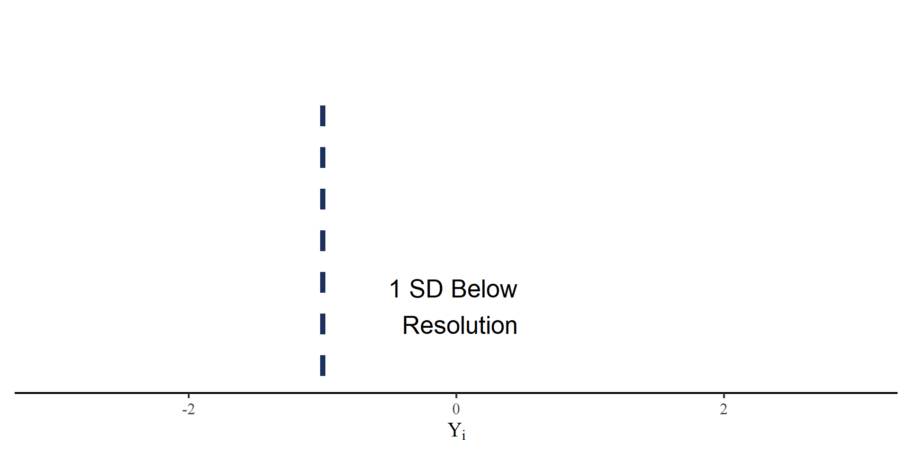
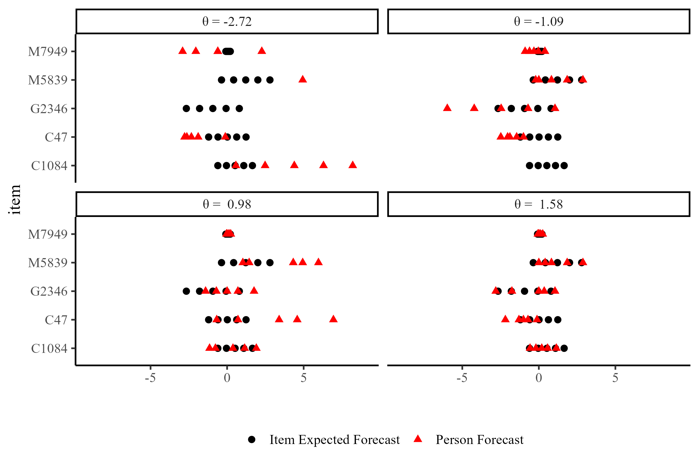
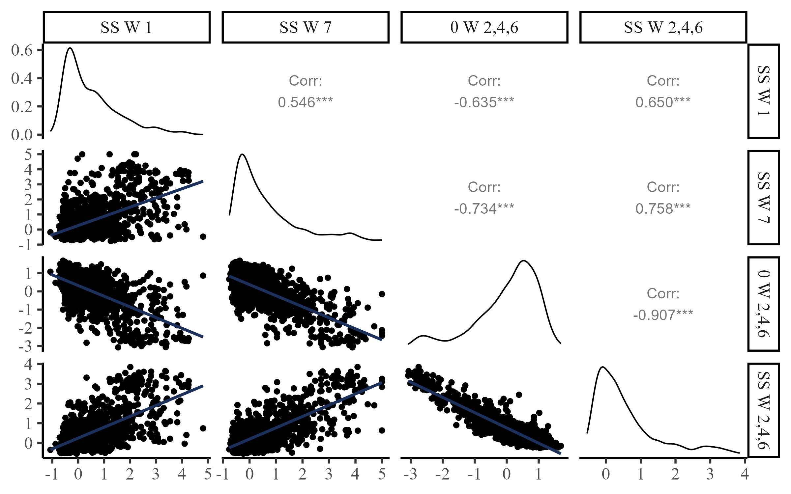
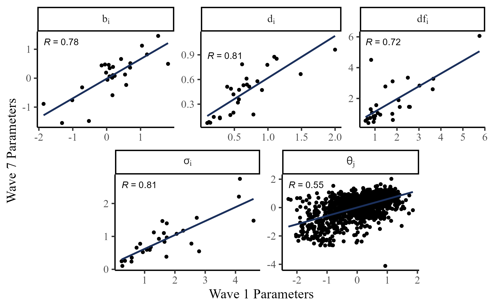

::: {.cell}

:::

##

  

## 

  

## 

  

## Psychometrics

:::: {.columns}
::: {.column width="60%"}

 

 
 The interest of *psychometrics* is uncovering the probabilistic process that <u>**causes**</u> item responses. 
 

 

in general, psychometric models are statistical models that predict item responses. All psychometrics models include:

- Parameters defining **item properties**
- Parameters defining **person properties**
- Allow for some **randomness** in item responses (random measurement error)

 

**Item response theory** (IRT) models include all of these components.

:::
::: {.column width="40%"}

{width="60%"}

:::
::::

## A Classical IRT Model

According to this IRT model, the *probability* of a correct response to a binary item ($Y = 1$) for person $j$ to item $i$: 

:::: {.columns}
::: {.column width="60%"}

<iframe class="stretch" width="100%" height="470px" src="https://quinix45.github.io/shinylive_apps/2PL_interactive/"> </iframe>

:::

::: {.column width="40%"}

$$P(Y = 1|a_i,b_i,\theta_j) = \mathrm{logit}(a_i(\theta_j - b_i))$$

- $\theta_j$ is an unobserved person trait that explains why responses from the same individuals are similar to each other (i.e., **ability**)

- $a_i$ and $b_i$ are characteristics that vary across items (e.g., items can be more or less difficult)

:::
::::

## Why Psychometrics and IRT?

Not only we explain the observed responses, but we also obtain **item characteristics** and **person characteristics** in the process. 

**Question:** Can we do the same for quantile items in the Forecasting Proficiency Test [FPT\; @Himmelstein_etal_2024]?

## Defining Forecast Accuracy

Responses to FPT quantile forecast items are on very different scale (e.g. dollars/gallon, thousands of dollars, percentages,...). We define the outcome measure, *historically scaled accuracy*, as

$$
Y_i = \frac{\hat{Y}_i - Y_{\mathrm{res},i}}{SD_{Y_{\mathrm{hist},i}}}
$$

:::: {.columns}
::: {.column width="55%"}

<ul style="font-size: 26px">  

<li>  $\hat{Y}_i$: Reported forecast for item $i$ at any quantile.   </li>

<li>  $Y_{\mathrm{res},i}$: The resolution for item $i$.   </li>

<li>  $SD_{Y_{\mathrm{hist},i}}$: The $SD$ of the historical time series of item $i$.    </li>

</ul>

:::
::: {.column width="45%"}

::: {.fragment fragment-index=1}

$Y_i$: SD units away from the resolution.

:::

::: {.r-stack}

::: {.fragment fragment-index=1}

::: {.cell}
::: {.cell-output-display}
{width=960}
:::
:::

:::

::: {.fragment fragment-index=2}

::: {.cell}
::: {.cell-output-display}
{width=960}
:::
:::

:::

::: {.fragment fragment-index=3}

::: {.cell}
::: {.cell-output-display}
{width=960}
:::
:::

:::

:::

:::
::::

## The Proposed Model

We model $Y_{jiq}$, the accuracy of person $j$ to item $i$ at quantile $q$. 

:::: {.columns}
::: {.column width="40%"}

$$Y_{jiq} \sim \mathrm{Student\ T}(\mu_{iq}, \sigma_{ji}, \mathrm{df}_i) \\
\mu_{iq} = b_i + Q_q \times d_i \\
\sigma_{ji} = \frac{\sigma_i}{\mathrm{Exp}[a_i \times \theta_j]}$$

<ul style="font-size: 22px">  

::: {.fragment fragment-index=1}
<li>  $b_i$: item bias (*irreducible uncertainty*) </li>
:::

::: {.fragment fragment-index=2}
<li>  $d_i$: expected quantile distance. $Q_q$ is a vector of constants that ensures monotonicity of $\mu_{iq}$  </li>
:::

::: {.fragment fragment-index=3}
<li>  $\sigma_i$: item difficulty </li>
:::

::: {.fragment fragment-index=4}
<li>  $\theta_j$: Forecasting ability, the only **person parameter** in the model </li>
:::

::: {.fragment fragment-index=5}
<li>  $a_i$: item discrimination (i.e. the magnitude of the effect of $\theta_j$ on $\sigma_i$)  </li>
:::

</ul>

:::
::: {.column width="60%"}

<iframe class="stretch" width="100%" height="550px" src="https://quinix45.github.io/shinylive_apps/t_model/"> </iframe>

:::
::::

## Model Estimation and Item Parameters

All models were estimated in PyMC [@pymc2023] using Markov Chain Monte Carlo (MCMC) estimation (warmup = 1000, draws = 5000, ~ 40 minutes). All Rhats $\leq 1.01$. 

::: {.fragment fragment-index=1}

{width=70%}

:::

## Person Parameter: $\theta$

Distribution of $\theta$ for the 1194 forecasters (better forecasters have higher $\theta$ values).

{width=70%}

 *note*. The scale $\theta$ parameter was identified by enforcing a standard normal prior.

## Who gets Higher $\theta s$?

Forecasters who consistently approach the expected forecasts are rewarded

:::: {.columns}
::: {.column width="80%"}

{width=75%}

:::
::: {.column width="20%"}

 

 *note*. In the case of the two top panels, missing person forecast were outside the $Y_{jiq} = [-9; 9]$ range.

:::
::::

## Negative Log-Likelihood of $\theta$

Negative log-likelihood function of $\theta$ given item parameters and participant response:

<iframe class="stretch" width="100%" height="500px" src="https://quinix45.github.io/shinylive_apps/MLE_theta_model_t/"> </iframe>

## Predicting Out of Sample Accuracy

 As per the study pre-registration, Waves 1 and 7 responses were treated as *outcome* and Waves 2,4, 6 were treated as *predictors*. 

::: {.fragment fragment-index=1}

:::: {.columns}
::: {.column width="30%"}

 
 

 **S-scores (SS):** A proper scoring rule that is normally used to score quantile forecasts (smaller SS, better forecast) 

:::
::: {.column width="70%"}

{width=95%}

:::
::::

:::

## Stability of Parameters

Given the complexity of the FPT items, item parameters are likely to change depending on many factors. Still, there seems to be reasonable stability even after a month between Wave 1 and Wave 7 (*test-retest*):

::: {.fragment fragment-index=1}

{width=58%}

 *note*. Only items from Waves 1 and 7. The $a_i$ parameter requires higher sample sizes to stably estimate, so it was fixed to 1. 

:::

## Takeaways

:::: {.columns}
::: {.column width="30%"}

::: {.fragment fragment-index=1}
- The current approach captures meaingful difference across FPT items (i.e., bias, difficulty, discrimination,...)
:::

::: {.fragment fragment-index=2}
- The $\theta$ metric is easily undesrtood and viable for scoring individuals 
:::

:::

:::{.column width="70%"}
:::{.r-stack}

::: {.fragment fragment-index=1 .fade-in-then-out}

:::

::: {.fragment fragment-index=2 .fade-in-then-out}

{width=50%}
{width=55%}

:::

:::
:::

::::

## Acknowledgments

:::: {.columns}
::: {.column width="30%"}

{width=50%}
 
<figure>
  
  <figcaption style="text-align:left;">Leah Feuerstahler</figcaption>
</figure>

:::
::: {.column width="70%"}

 
{width=50%}

<figure>
  
  <figcaption>Mark Himmelstein</figcaption>
</figure>
<figure>
  
  <figcaption>Sophie Ma Zhu</figcaption>
</figure>
<figure>
  
  <figcaption>Nikolay Petrov</figcaption>
</figure>
<figure>
  
  <figcaption>Ezra Karger</figcaption>
</figure>

:::
::::

## References And Contacts

 

:::: {.columns}
::: {.column width="50%"}

 Contact: [fsetti@fordham.edu](mailto:fsetti@fordham.edu){target="_blank"}
 

<figure>
  
</figure>

:::
::: {.column width="50%"}

 **Slides and More** 

<figure>
  

</figure>

:::
::::
{target="_blank"}

